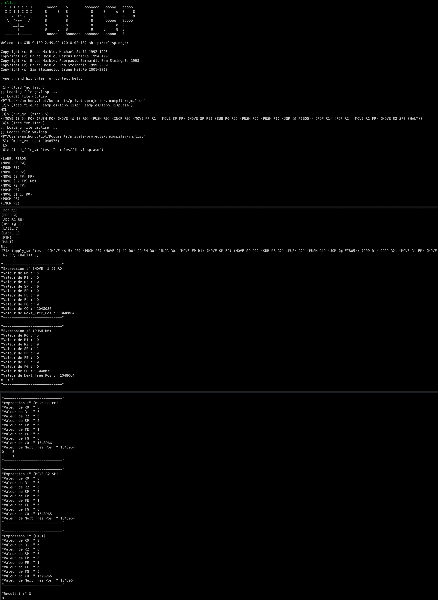

<h1 align="center">Compiler & Virtual Machine</h1>

<strong>Compiler & Virtual Machine in Lisp</strong>
 2008

 
<h2>About</h2>
This project was developed during my Master degree in Montpellier, France.
 
This code use Lisp to create a pseudo compiler capable to compile lisp code into pseudo assembly. The code also include a virtual machine in lips capable to load the pseudo assembly code generated by the compiler.
 

<h2>Installation</h2>

1. Download this project as zip and extract it
2. Download the Lisp Toolkit 

<h2>Usage</h2>

1. Use the compiler to create ASM code
    1. (load "gc.lisp") *- load of the compiler code*
    2. (load_file_gc "samples/fibo.lisp" "samples/fibo.lisp.asm") *- Compile the lisp source code into assembly code*
    3. (run_gc '(fibo5 5)) *- Generate an assembly code to exec a command to use inside the virtual machine*

2. Use the compiler to create ASM code
    1. (load "vm.lisp") *- load of the vm code*
    2. (make_vm 'test 1048576) *- create the vm name and memory*
    3. (load_file_vm 'test "samples/fibo.lisp.asm") *- load the assembly code we want to run*
        1. (apply_vm 'test '((MOVE ($ 5) R0) (PUSH R0) (MOVE ($ 1) R0) (PUSH R0) (INCR R0) (MOVE FP R1) (MOVE SP FP) (MOVE SP R2) (SUB R0 R2) (PUSH R2) (PUSH R1) (JSR (@ FIBO5)) (POP R1) (POP R2) (MOVE R1 FP) (MOVE R2 SP) (HALT)) 1) *- use the assembly snippet code from run_gc to launch a command (here: fibo5 5) in debug mode*
        2. (apply_vm 'test '((MOVE ($ 5) R0) (PUSH R0) (MOVE ($ 1) R0) (PUSH R0) (INCR R0) (MOVE FP R1) (MOVE SP FP) (MOVE SP R2) (SUB R0 R2) (PUSH R2) (PUSH R1) (JSR (@ FIBO5)) (POP R1) (POP R2) (MOVE R1 FP) (MOVE R2 SP) (HALT)) nil) *- use the assembly snippet code from run_gc to launch a command (here: fibo5 5) in non interractive mode*

<h2>Copyright</h2>
This project is licensed under the terms of the MIT license. See <a href="LICENSE">license</a>.